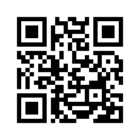

# Qrusty

QR Code generator that leverages [precompiled Rust](https://github.com/philss/rustler_precompiled).

The "precompiled" implies that using this library does not require installing Rust.

## Installation

QRusty at the moment is NOT on Hex.

~~The package can be installed by adding `qrusty` to your list of dependencies in `mix.exs`:~~

```elixir
def deps do
  [
    {:qrusty, github: "nbw/qrusty"}
  ]
end
```

## Usage

The following QR formats are supported:

- SVG (`:svg`)
- PNG (`:png`)
- JPG (`:jpg`)
- base64 PNG (`:png64`)
- base64 JPG (`:jpg64`)

### SVG

```elixir
> {:ok, %Qrusty.QR{encoded_data: svg}} = Qrusty.qr("https://elixir-lang.org/", :svg, size: 200)

File.write("./assets/qr.svg", svg)
```

### PNG/JPG

```elixir
> {:ok, %Qrusty.QR{encoded_data: binary}} = Qrusty.qr("https://elixir-lang.org/", :png, width: 200, height: 200)

File.write("./assets/qr.png", binary)

> {:ok, %Qrusty.QR{encoded_data: binary}} = Qrusty.qr("https://elixir-lang.org/", :jpg, width: 200, height: 200)

File.write("./assets/qr.jpg", binary)
```

### Base64 PNG/JPG

```elixir
# :png64 or :jpg64
> {:ok, %Qrusty.QR{encoded_data: binary_64}} = Qrusty.qr("https://elixir-lang.org/", :png64, width: 200, height: 200)

# Heex Template (for example)
<a href={"data:image/png;base64, " <> binary_64} download="qr.png">
   binary_64}></img>
</a>
```

| Format | Sample                         |
| ------ | ------------------------------ |
| SVG    |         |
| PNG    |         |
| JPG    |         |
| PNG64  | [ sample ](assets/base65.html) |
| JPG64  | --                             |

## Benchmarks

Benchmarks have been included to compare Qrusty (Rust based) to [EQRCode](https://github.com/SiliconJungles/eqrcode) (Elixir based), as it's the defacto Elixir QR Code library.

**Note**: since the execution time of generating a single QR code is so fast, benchmarking was not very accurate. To compensate, **the benchmarks measure the execution time for generating 100 QR codes.**

### Usage

Run the following:

```
mix run benchmarks/png.exs
mix run benchmarks/svg.exs
...
```

### Summary

The full results are [here](/BENCHMARKS.md).

Qrusty vs EQRCode (x times faster)

|     | 100x100 | 200x200 | 500x500 |
| --- | ------- | ------- | ------- |
| PNG | 27.43x  | 18.86x  | 7.21x   |
| SVG | 42.83x  | 44.02x  | 43.87x  |
| JPG | -       | -       | -       |

Trends: QRusty executes faster than QRCode, but the gains decrease with larger image sizes.

## Development

You will need the following installed:

- Elixir
- Rust
- [Cross](https://github.com/cross-rs/cross)

### Compiling QRusty

```
mix compile.local
```

## Contributions

Contributions are welcome.

### Rust Contribution Rules

- The Rust layer should be as thin as possible
- The Rust layer should not deal with errors caused by human input (ex: invalid input args). Deal with interface errors in Elixir
- Default values, etc. should all be handled on the Elixir side

Basically, the end user is an Elixir developer, so keep as much code as possible in Elixir for readability. Leverage Rust only for its performance benefits/access to system level libraries, etc. 🙏

# Thanks

- Thanks to kennytm for [qrcode-rust](https://github.com/kennytm/qrcode-rust)
- Thanks to qm3ster for [this PR](https://github.com/qm3ster/qrcode-rust) to support image v0.24
- Thanks to the creators of [EQRCode](https://github.com/SiliconJungles/eqrcode)

# Copyright and License

This library is released under the MIT License. See the [LICENSE.md](/LICENSE.md) file.
